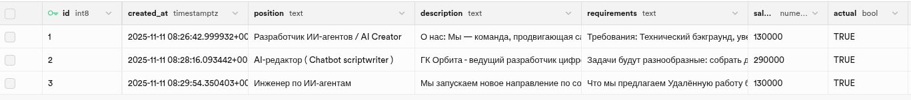
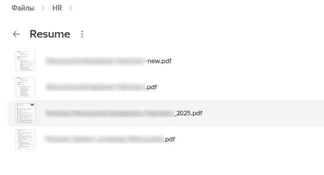
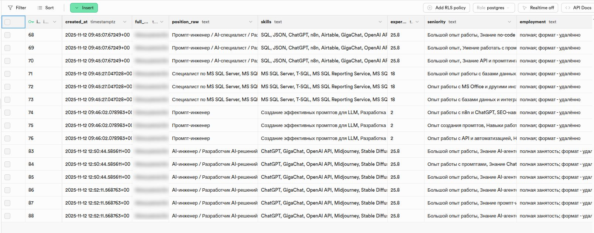
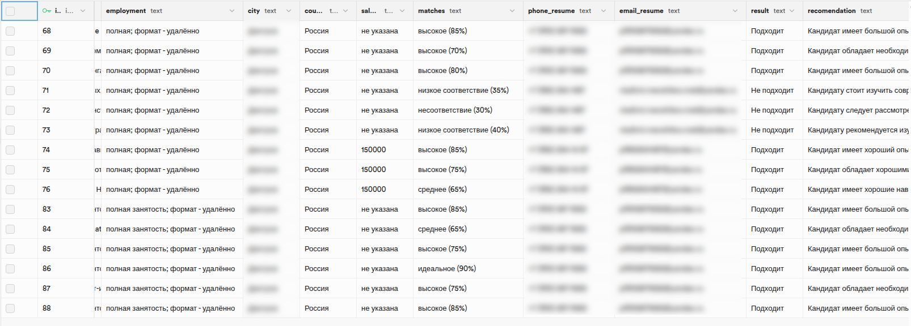
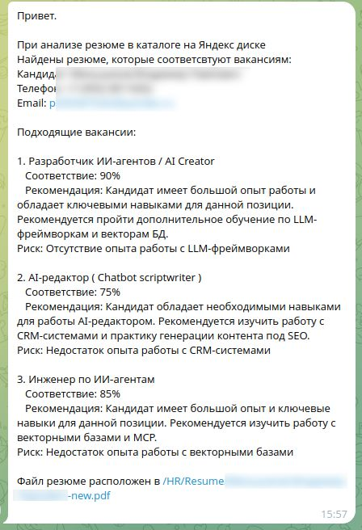
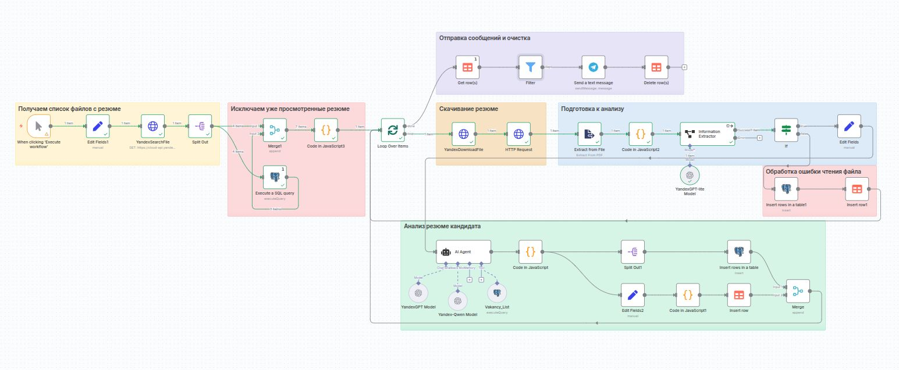

# Автоматический AI-ассистент 
**Описание скриншотов** 📸

--- 

[⬅️ Вернуться к описанию проекта](../README.md)

---

### 1. Таблица с актуальными вакансиями

Содержит все открытые позиции, ключевые требования и параметры для эффективного соответствия.

### 2. Каталог с резюме для проверки 
 

Визуализация структуры папок с загруженными на Яндекс.Диск резюме, готовыми к автоматическому анализу.

### 3. Таблицы с результатами проверки соответствия
  

Детализированный отчёт о степени соответствия каждого кандидата критериям различных вакансий.

### 4. Сообщение в Telegram о подходящем кандидате
 

Автоматическое уведомление HR о релевантных кандидатах с аналитической сводкой.

### 5. Рабочий процесс в n8n
 

Визуализация автоматизированного процесса: сбор, анализ и распределение информации с помощью AI и интеграций.

Эти скриншоты показывают, насколько удобно и прозрачно работает AI-ассистент, делая найм современным, быстрым и эффективным.

--- 

[⬅️ Вернуться к описанию проекта](../README.md)
